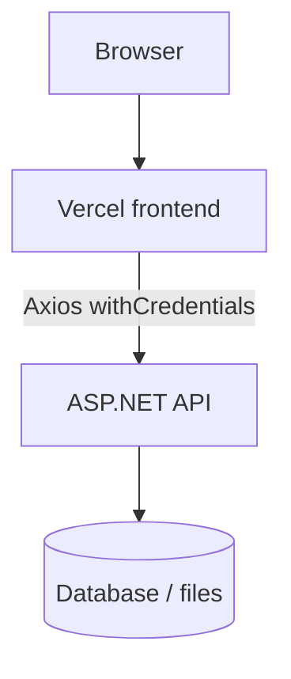

# Exam Archive Frontend — Code Walkthrough

Use this as a study sheet for the presentation. It explains **what the project is**, **how the code is organized**, and **how to talk about important parts** if an examiner points at a file.

The project is a **React + TypeScript SPA**. It is the frontend of an exam-paper archive: students log in, browse papers, upload new papers, and staff can approve or reject submissions. The UI is hosted on **Vercel**. The API is a separate ASP.NET backend on **MonsterASP.NET**.

---

## 1. How to describe the project in 30 seconds

> This is a university exam archive. After login, users browse papers by study program, major, subject, exam type, month, year, and status. They can upload PDF or image files. Moderators have a pending-review page to approve or reject submissions with a reason. The app is multilingual: English, Serbian Latin, and Serbian Cyrillic. Authentication uses an HttpOnly session cookie from the backend, so the browser never stores the password.

If asked “why a SPA?”: the UI is interactive (filters, modals, pagination, language switching). Vite builds static files for Vercel. The backend stays responsible for security, database, and files.

---

## 2. Architecture



Layering inside the frontend:

| Layer | Folder | Job |
| --- | --- | --- |
| Entry | `src/main.tsx` | Mount React, wrap providers |
| Routing | `src/router.tsx` | Login vs protected pages vs staff-only page |
| Pages | `src/pages/` | Screen-level UI |
| Components | `src/components/` | Reusable layout, forms, modals, language switcher |
| Services | `src/services/` | HTTP calls to the API |
| Types / helpers | `src/lib/` | Domain types, Axios client, role helpers |
| i18n | `src/i18n/` | Translations and Cyrillic transliteration |

**Important talking point:** pages do not call `fetch` directly. They call functions in `src/services/`. Those functions use a shared Axios instance. If the API URL or error format changes, you change one place.

---

## 3. Application startup (`src/main.tsx`)

This is the first TypeScript file the browser runs (`index.html` loads `/src/main.tsx`).

Provider order:

1. **`QueryClientProvider`** (TanStack Query) — caches GET results, retries failed requests once, does not refetch when the window is focused.
2. **`BrowserRouter`** — client-side routing (`/login`, `/home`, `/papers`, `/pending`).
3. **`AuthProvider`** — restores the current user from `GET /api/me`.
4. **`AppRouter`** — decides which page to show.

`import './i18n'` runs **before** the tree is rendered. That initializes i18next, reads the saved language from `localStorage`, and sets `<html lang>`.

If asked “why QueryClient at the top?”: login, papers, lookups, and paper details all use the same cache. After logout, paper queries are removed so the next user does not see the previous user’s data.

---

## 4. Authentication

### 4.1 Cookie session, not JWT in localStorage

`src/lib/axios.ts` creates Axios with:

- `baseURL` from `VITE_API_URL` (fallback `https://localhost:7294`)
- `withCredentials: true`

That means every request includes the backend **HttpOnly cookie**. The frontend never stores the password or a token in JavaScript. XSS cannot steal the cookie as easily as a token in `localStorage`.

**CORS:** the API must allow the frontend origin (`http://localhost:5173` and the Vercel domain) **and** `AllowCredentials`. Without `Access-Control-Allow-Origin` matching that origin, the browser blocks `/api/me` and `/api/login`. That is a backend CORS policy, not a React bug.

### 4.2 Auth context (`src/hooks/useAuth.ts` + `src/components/auth/AuthProvider.tsx`)

`useAuth()` is a React context hook. If a component uses it outside `AuthProvider`, it throws. That prevents silent `null` bugs.

`AuthProvider` does three things:

1. **Session restore:** `useQuery(['auth', 'me'], getCurrentUser)`. On first load it calls `GET /api/me`. If the cookie is valid, `user` is filled. If not, the user is treated as logged out.
2. **Login:** `useMutation` calling `POST /api/login`. On success it writes the returned user into the same query cache, so the UI updates immediately without another round trip.
3. **Logout:** `POST /api/logout`, then sets the user to `null` and **removes all paper queries**.

Talking point: `retry: false` on `/api/me` is intentional. A 401 means “not signed in”, not a flaky network that should be retried.

### 4.3 Login page (`src/pages/LoginPage.tsx`)

Flow:

1. If `user` already exists, redirect to `/home`.
2. Client-side validation (username required, max 50; password required, max 128).
3. Call `login()`.
4. On success, go to `location.state.from` if the user was sent here from a protected page, otherwise `/home`.
5. On `ApiError`, show field errors (`Username` / `Password`) and a general message.

All visible text goes through `t('auth....')` so language switching works here too. The language selector sits in the top-right **before** login.

---

## 5. Routing and roles (`src/router.tsx`)

```text
/login          public
/               protected → redirect /home
/home           protected, inside AppShell
/papers         protected, inside AppShell
/pending        protected + staff only, inside AppShell
*               redirect /home
```

### `ProtectedRoute`

- While `/api/me` is loading: show “restoring session”.
- If no user: redirect to `/login` and remember the original URL in `state.from`.
- If user exists: render children.

### `StaffRoute`

Uses `isStaff(user.role)` from `src/lib/utils.ts`. Roles are numbers:

```text
SuperAdmin = 1
Admin      = 2
Moderator  = 3
User       = 4
```

**Lower number = more privilege.** Staff means `role <= Moderator` (1, 2, or 3). A normal user hitting `/pending` is sent to `/home`.

`RoleGate` in `src/components/auth/RoleGate.tsx` is the same idea for hiding UI pieces. The router currently uses `StaffRoute` instead; `RoleGate` is available for future admin widgets.

**Honest point for the examiner:** `/pending` exists and works, but the sidebar currently only lists Home and Papers. Staff can still open `/pending` by URL. Adding a nav item is a planned improvement (`features.md`).

---

## 6. Layout after login

### `AppShell`

Sidebar + header + `<Outlet />`. The outlet is where `/home`, `/papers`, or `/pending` render. Header contains:

- mobile menu button
- language switcher
- “Signed in as {username}”

### `Sidebar`

Nav links (`NavLink` so the active route is highlighted), brand name, profile menu, sign out. Labels are translation keys (`shell.home`, `shell.papers`), not hardcoded English.

---

## 7. Domain model (`src/lib/types.ts`)

This file is the contract with the backend. Good exam answer: “the frontend types mirror the API DTOs.”

- **Lookups:** `Study`, `Major`, `Subject` each have `nameEn` and `nameSr`. The UI picks one depending on language.
- **Paper:** subject names, exam type (`Midterm` / `Final` / `Resit`), month, year, page count, timestamps, `status`, optional `rejectionReason`, optional `isOwnedByCurrentUser`.
- **Statuses** are ordered `Pending`, `Rejected`, `Approved` so tables can sort by `PAPER_STATUSES.indexOf(status)`.
- **Pagination:** `{ data, meta: { page, perPage, totalItems, totalPages } }`.

Visibility rule (must also be enforced on the **server**):

- Staff: all papers.
- Regular user: all **Approved** papers, plus **Pending/Rejected** papers they uploaded (`isOwnedByCurrentUser`).

The frontend also filters defensively on `PapersPage`. That is **not** security by itself; a user could still call the API. Real protection is backend authorization (`BACKEND_API_REQUIREMENTS.md`).

---

## 8. HTTP client (`src/lib/axios.ts`)

Two interceptors:

**Request:** if the body is `FormData` (file upload), delete `Content-Type` so the browser sets `multipart/form-data` with the boundary. Otherwise set JSON.

**Response:** convert Axios errors into `ApiError`:

- No response (network / CORS / backend down) → localized “connection failed”.
- ASP.NET ProblemDetails → `title`, `detail`, `errors` dictionary for field-level validation.

Pages then do `error instanceof ApiError` and show `error.message` or `fieldError(error.errors, 'Username')`.

`fieldError` in `utils.ts` matches keys case-insensitively because .NET often sends `Username` while the form uses `username`.

---

## 9. Services

### Auth — `src/services/auth.ts`

- `POST /api/login`
- `GET /api/me`
- `POST /api/logout`

### Lookups — `src/services/lookups.ts`

Cascading academic data:

1. Studies
2. Majors for a study
3. Subjects for a major

Queries use `staleTime: 30 minutes` because this data rarely changes.

### Papers — `src/services/papers.ts`

| Function | HTTP |
| --- | --- |
| `getPapers(query)` | `GET /api/papers` with filter query params |
| `getPaper(id)` | `GET /api/papers/{id}` |
| `uploadPaper` | `POST /api/papers/upload` as `FormData` |
| `approvePaper` | `POST /api/papers/{id}/approve` |
| `rejectPaper` | `POST /api/papers/{id}/reject` `{ reason }` |

`paperKeys` is the React Query cache key factory. Invalidating `paperKeys.all` after upload/approve/reject refreshes every paper list.

---

## 10. Screens

### Home (`HomePage.tsx`)

Two actions: go to papers, or open the upload modal. Intentionally simple.

### Papers (`PapersPage.tsx`) — densest screen

**Filters live in the URL** (`useSearchParams`), not only in React state. That means:

- refresh keeps the same filters
- the URL can be shared
- back/forward works

Changing study clears major/subject. Changing major clears subject. Changing any filter except page resets page to 1.

Lookups are **dependent queries**: majors only load when a study is selected (`enabled: Boolean(filters.studiesId)`).

The table shows status badges. Rows are sorted Pending → Rejected → Approved. Ordinary users only see approved papers plus their own non-approved ones.

Clicking a row or Details opens `PaperDetailsModal`.

### Pending papers (`PendingPapersPage.tsx`) — staff workflow

Always queries `status: 'Pending'`. Approve uses `window.confirm`, then `approvePaper`. Reject opens a modal that requires a 3–500 character reason. After either action, paper queries are invalidated so both this page and `/papers` update.

### Upload modal (`UploadPaperModal.tsx`)

Cascade of dropdowns (program → major → year → subject), exam type, month, year, file drop zone.

Client validation before upload:

- required study, major, subject, month
- year between 1990 and next year
- 1–10 files
- at most 2 PDFs
- only pdf/jpg/png/webp
- 20 MB per file, 100 MB total

Files can be reordered (order is how they are stored). Success can show a **claim token** if the API returns one (shown only once).

### Details modal (`PaperDetailsModal.tsx`)

Loads one paper when `paperId` is set (`enabled: paperId !== null`). Shows metadata, file list (type + size), and rejection reason if present. It does **not** preview/download file bytes yet; that needs a backend download endpoint.

---

## 11. Shared UI (`src/components/ui/`)

Reusable primitives so pages look consistent:

- `Button`, `Field`, `Input`, `Select`, `Textarea`
- `Modal` (Escape to close, body scroll lock)
- `DataTable`, `Pagination`
- `StatusBadge` (color by status, translated label)
- `LoadingState` / `ErrorState` / `EmptyState`
- `FilterPanel`, `FileDropZone`

If asked “why a UI kit?”: pagination, badges, and errors are used on multiple pages; translating them once is easier.

---

## 12. Internationalization

### Setup (`src/i18n/index.ts`)

Languages: `en`, `sr-Latn`, `sr-Cyrl`. Preference is stored in `localStorage` under `exam-archive-language`. On change:

- `document.documentElement.lang` updates (accessibility / browser)
- document title and meta description update
- React re-renders every `t('...')`

### Resources (`src/i18n/resources.ts`)

English object `en` and Serbian Latin object `srLatn`. Cyrillic is **not** hand-maintained:

```ts
export const srCyrl = transliterateResource(srLatn)
```

### Transliteration (`src/i18n/transliterate.ts`)

Maps Serbian Latin letters to Cyrillic, including digraphs `lj`, `nj`, `dž` so they become one letter (`љ`, `њ`, `џ`). Academic names from the API (`nameSr`) are Latin; when the UI language is Cyrillic, `localizedName()` runs the same conversion.

**How to customize text:** edit `en` and `srLatn` in `resources.ts`. Keep the **key** (`auth.heroTitle`) unless you also change `t('auth.heroTitle')` in the component. Placeholders like `{{count}}` must stay in every language.

**How to remove text:** delete the JSX that calls `t(...)`, then delete the unused keys from both `en` and `srLatn`. Cyrillic follows automatically.

---

## 13. Helpers (`src/lib/utils.ts`)

| Helper | Purpose |
| --- | --- |
| `cn` | Join Tailwind class names |
| `isStaff` / `isAdmin` | Role checks |
| `roleName` | Map role number to `Admin`, `User`, … |
| `formatDate` / `formatBytes` | Locale-aware formatting |
| `monthNames` | 12 month labels via `Intl` |
| `localizedName` | `nameEn` vs `nameSr` (+ Cyrillic) |
| `compareLocalizedNames` | Sort dropdowns in the active language |
| `fieldError` | Read ASP.NET validation dictionary |

---

## 14. Data flow example: “user opens Papers”

1. Router sees a logged-in user and renders `AppShell` + `PapersPage`.
2. `PapersPage` reads URL query params into a `PaperQuery`.
3. React Query fetches studies (always) and papers (`GET /api/papers?...`).
4. If the user selected a study, majors load; if a major, subjects load.
5. Subject names and table copy follow the current i18n language.
6. Changing a filter writes URL params → query key changes → new request.
7. Opening Details fetches `GET /api/papers/{id}` only then.

This is a good place to mention **caching**: lookups stay for 30 minutes; paper lists use `placeholderData` so pagination does not flash empty.

---

## 15. Likely examiner questions

**Why TypeScript?**  
Catch mismatches with the API at compile time (`PaperStatus`, `ExamType`, `UserRole`). `npm run build` runs `tsc -b` then Vite.

**Why TanStack Query instead of only `useEffect` + `useState`?**  
Caching, dependent queries, loading/error flags, and invalidation after mutations.

**Why are filters in the URL?**  
Shareable, refresh-safe, works with browser history.

**Is frontend role checking enough?**  
No. It only hides UI. The API must reject unauthorized approve/reject and hide other users’ pending papers.

**Why cookies instead of putting JWT in localStorage?**  
HttpOnly cookies are not readable from JavaScript. CORS + `SameSite=None; Secure` is required because Vercel and the API are different sites.

**What is still missing?**  
In-app PDF/image preview and download; sidebar link to `/pending`; My Uploads / My Profile; admin CRUD for users and subjects. See `features.md`.

**Where would you add a new page?**  
1. Add a route in `router.tsx` (wrap with `ProtectedRoute` / `StaffRoute` as needed).  
2. Create a page under `src/pages`.  
3. Add a service function if it needs the API.  
4. Add English + Serbian Latin strings in `resources.ts`.  
5. Link it from `Sidebar` or `HomePage`.

---

## 16. File map (quick)

```text
index.html                 HTML shell, loads main.tsx
src/main.tsx               Providers
src/router.tsx             Routes and guards
src/pages/                 Login, Home, Papers, Pending
src/components/auth/       AuthProvider, RoleGate
src/components/main/       AppShell, Sidebar
src/components/papers/     Upload and details modals
src/components/i18n/       Language switcher
src/components/ui/         Shared controls
src/services/              API functions
src/lib/axios.ts           HTTP client + ApiError
src/lib/types.ts           Domain types
src/lib/utils.ts           Roles, dates, localized names
src/i18n/                  Translations
src/hooks/useAuth.ts       Auth context hook
```

Legacy Vite scaffold files (`src/App.jsx`, `src/main.jsx`) are **not** the running app. The live entry is `src/main.tsx`.

---

## 17. How to demo live

1. Open the deployed frontend (or `npm run dev` against the API).
2. Switch language on the login page; title and form labels should change.
3. Sign in; show Home → Papers filters, status column, pagination.
4. Open Details; mention files are metadata until download exists.
5. Upload a paper; it should appear as Pending.
6. As a moderator, open `/pending`, approve one and reject one with a reason.
7. If asked about CORS: frontend origin must be in the API CORS policy with credentials.

If something fails, check: API running, `VITE_API_URL` on Vercel, cookie `Secure` + `SameSite=None`, CORS origins without trailing slashes.
